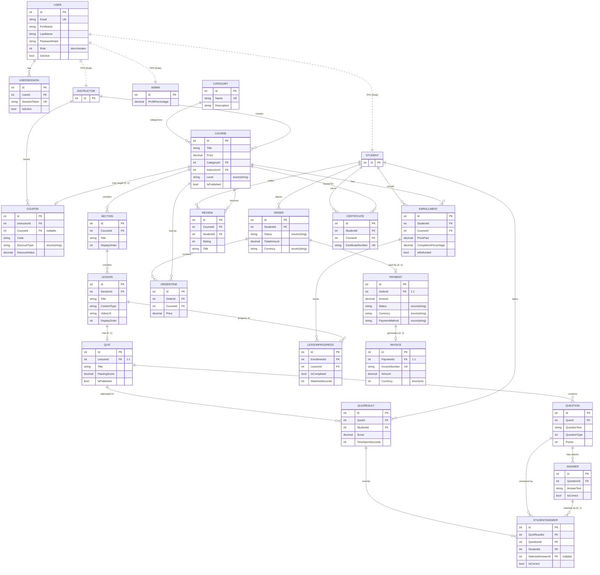

# E-Learning Platform — Entity Relationship Diagram

> Generated from the EF Core model (`AppDbContext.OnModelCreating`).
> `User` uses **TPH** (Table-Per-Hierarchy): `Student`, `Instructor`, `Admin` all live in the `Users` table, discriminated by `Role`.

## Unique constraints / indexes
- `User.Email`, `UserSession.SessionToken`, `Category.Name`, `Invoice.InvoiceNumber`, `Certificate.CertificateNumber` — unique
- `Enrollment (StudentId, CourseId)` — unique (one enrollment per student/course)
- `LessonProgress (EnrollmentId, LessonId)` — unique
- `Review (CourseId, StudentId)` — unique (one review per student/course)
- `OrderItem (OrderId, CourseId)` — unique
- `Certificate (StudentId, CourseId)` — unique
- `Coupon.Code` — indexed (**not** unique — see note)

## Notes / known model caveats
- All `Cascade` deletes are globally downgraded to `Restrict` in `OnModelCreating`, so no parent hard-delete cascades to children.
- `Invoice.Currency` is stored as `int` while `Payment/Order` currency are stored as strings (inconsistency).
- `Coupon.Code` index is not unique.
- TPH subtype FKs (`Course.InstructorId`, `Student`-typed FKs, etc.) reference the shared `Users` table; the discriminator is not enforced at the DB level.
